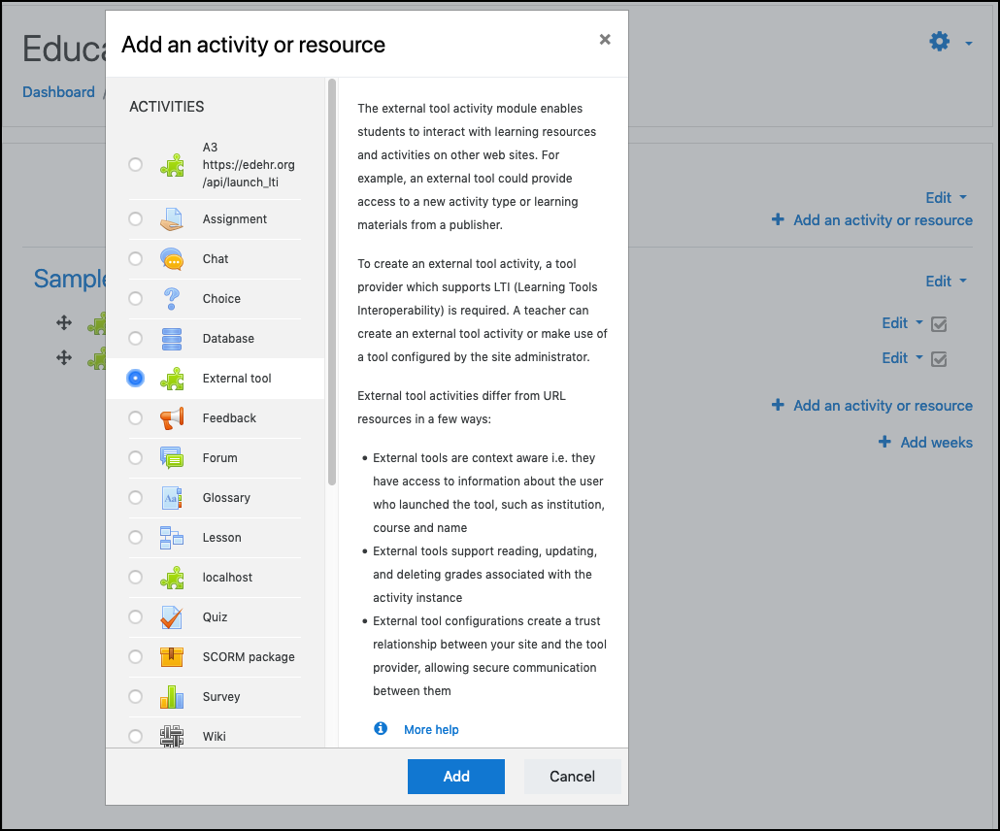

# Glossary

## Activity
An activity is the general name for a group of different functionalities within a Moodle course. There are internal activities that use Moodle technology for things like forums, quizzes, and simple form-based assignments. The EdEHR is an example of an [external tool](#tool) activity which is linked to from the LMS, but is not a part of the LMS itself. No other types of activites are linked to the EdEHR.

## Assignment
While LMS's do have assignment activities, we only use the external tool activity to connect to the EdEHR. Within the EdEHR, an assignment refers to the chunk of work that a student is required to complete and submit to an instructor for evaluation. Do not confuse it with a LMS assignment.

## API url
See [Tool URL](#tool-url).

## Application navigation
The horizontal navigation bar at the top of all screens within the EdEHR software. It appears for all users, although each user type has a different set of links that they are able to access from it.

## Class list
A list of students that have accessed the related assignment within the EdEHR.

## Consumer key and secret
Two pieces of data that are unique to each LMS and act like a special password to allow the LMS to send data to the EdEHR securely.

## Course
A course is a container in which a instructor will add resources and [activities](#activity) for their students to complete.

## Course designer functionality
The name of a checkbox that allows a course designer to access their admin screens while in the instructor view of the EdEHR.

## Courseware
Software designed for use in an educational or training program. The EdEHR is an example of courseware.

## Dashboard
The EdEHR software is described in two parts - Dashboard and EHR. The dashboard represents the educational management screens used by admins and instructors. These screens are not seen by students.

## Educational Electronic Health Records (EdEHR))
The name of the application. Generically, the EdEHR is a [LTI Provider](#lti-provider).

## EHR navigation
The left side navigation bar with links to each of the pages contained within the EHR.

## Electronic Health Records (EHR)
The EdEHR software is described in two parts - Dashboard and EHR. The EHR represents a steamlined professional EHR experience for students to use to complete assignments. It is seen below the [application navigation](#application-navigation) and [evaluation panel](#evaluation-panel). 

## Evaluation notes
The EdEHR is equipped to allow instructors to leave general evaluation notes for the entire assignment. There is no functionality to give an explicit grade to students at this time.

## Evaluation panel
The area under the application navigation that is used by instructors to add evaluation notes and viewed by students to receive evaluation notes.

## External id
This is the id used by the LMS and EdEHR to link a activity with an EdEHR assignment. When the LMS admin creates the LTI connection they add a "custom parameter". (See [LMS-admin](/lms-admin/)). 

## Learning Management System (LMS)
An application used by post-secondary institutions to offer courses and manage student records. This can also be referred to generically as a tool consumer.

## Learning Tools Interoperability (LTI)
A technology that allows a LMS to link to and use content from a courseware provider that complies with the LTI standard. The EdEHR supports [LTI 1.1](https://www.imsglobal.org/specs/ltiv2p0/implementation-guide). 

## LTI consumer
The LMS that receives content from the LTI provider.

## LTI provider
A web service that provides courseware resources to [tool consumers](#tool-consumer) using [LTI](learning-tools-interoperability (LTI)). The EdEHR is a LTI Provider.

## Resources
A supporting document that is given to students as a reference material to help students complete their assigned [activity](#activity) (In the case of the EdEHR, an assignment.)

## Seed
The initial data a student will see upon entering the EHR. It can be some or all of the medical data within a case study that that the assignment is based on. This can only be entered by a course designer into the EdEHR.

A seed can be used by multiple students and for multiple assignments. It is the base of which a students fills in their assignment data, which is then written to a different file for the instructor to evaluate upon submission.

## Tool
A generic technical term, in this case used to describe the EdEHR.

## Tool consumer
Any system that offers access to a [Tool](#tool). See [LMS](#lms) for more details.

## Tool URL
This can also be referred to an API URL. It is the link that will launch the EdEHR (the [tool](#tool)). For example, https://edehr.org/api/launch_lti. It is added to the LMS so that users can access the EdEHR only from an authenticated LMS account. 
